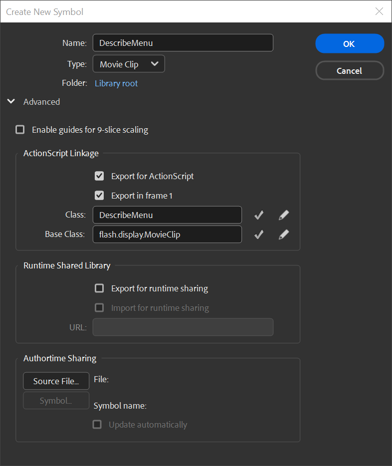
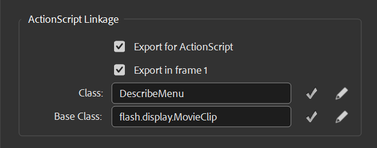
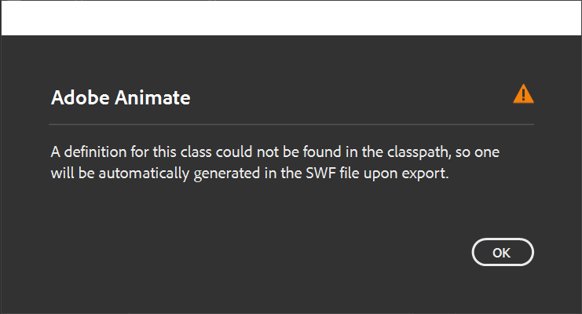
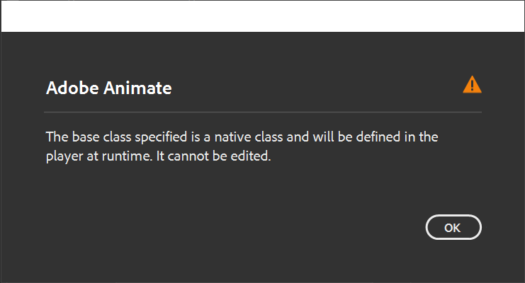
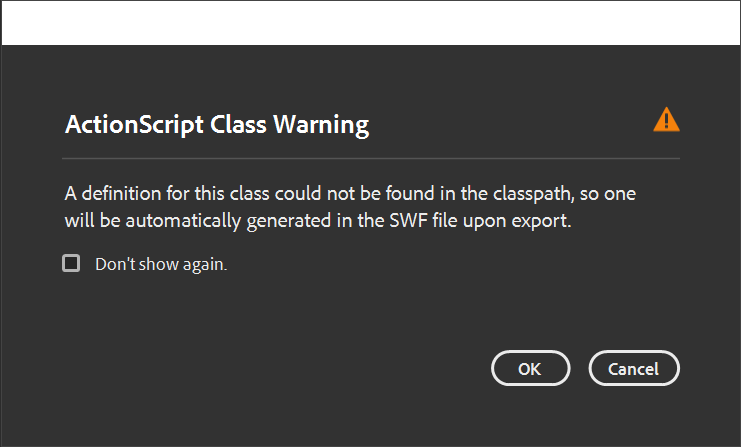
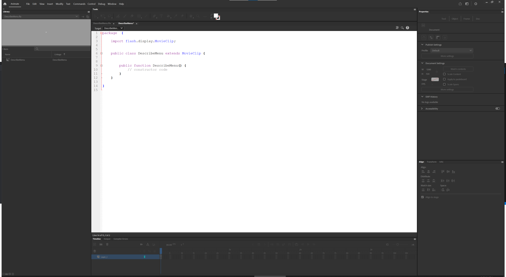

This document covers the process of adding class linkage to library objects.

### Create a MovieClip symbol
Now lets create the main class for our new menu.

Right-click the Flash library and select "New symbol...".

Set the symbol name to `DescribeMenu`.

Change the symbol type to "Movie Clip".




### Add class linkage to MovieClip library object
Expand the "Advanced" options, and under the "ActionScript Linkage" section enable the "**Export for ActionScript**" check box.

After checking "Export for ActionScript", some class linkage details will be generated for this `MovieClip` symbol.
Lets take a closer look at the *ActionScript Linkage* section of the symbol properties window.

Notice that the **Class** field was filled to `DescribeMenu` which is the same name as the library symbol you entered.
The library symbol and class name do not need to match, but doing so is good practice.
This **Class** name will be directly related to a `DescribeMenu.as` class file.

The **Base Class** field may be filled to `flash.display.MovieClip`.
This is the **Base Class** that your **Class** directly extends, also known as inheritance.
By default the `flash.display.MovieClip` class is used for *Movie Clip* symbols.





Notice again two buttons to the right of each linkage field which are a check mark and a pencil icon.

The check mark button is to "**Validate class definition**", and the pencil button is to "**Edit class definition**".

Selecting the *Validate class definition* will check if the file exists and the syntax is correct.
Select the *Validate class definition* for the *Class* field now.

We get the following message explaining that no existing class file on disk matches our linkage identifier.
Nothing to worry though, we will correct this shortly.
Press *OK* when you understand the warning.


> Adobe Animate
>
> A definition for this class could not be found in the classpath, so one will be automatically generated in the SWF file upon export.



Now turn your attention to the *Base Class* field and select the *Validate class definition* button.
We get a different message this time.

The default `flash.display.MovieClip` class is a part of the ActionScript 3.0 framework library.
This is the base class for all *Movie Clip* library symbols.

The message explains that the class is a built-in native that cannot be edited, although it can be extended as base classes usually are.
Press *OK* when you understand the warning.

> Adobe Animate
>
> The base class specified is a native class and will be defined in the player at runtime. It cannot be edited.



With our ActionScript linkage identifier established, the next step is to save the class definition to disk.
At this point you can proceed in one of two ways from the new symbol property window.


#### Option 1: Press the *Edit class definition* button
If you click the pencil icon to edit your library symbol's **Class**, the property window is immediately closed and you are shown the code editor for you class.


#### Option 2: Press the *OK* button
If you did not take option 1, press "OK" to finish creating this new `MovieClip` symbol.

You might take this option if you want to establish ActionScript linkage on a symbol, but don't want to write the class right away.
If you publish your Flash document but forget to write these classes then Flash with infer a definition for you depending on your publish settings.
I do not recommend letting flash infer class definitions.

Upon clicking "OK" on the symbol property window, you may get a warning stating the following.

> ActionScript Class Warning
> A definition for this class could not be found in the classpath, so one will be automatically generated in the SWF file upon export.


This is nothing to be alarmed over as Flash is just informing you of it's normal operation for assigning ActionScript linkage to library symbols.
When you assign an ActionScript linkage identifier to a library symbol, Flash will not actually create the associated class file.

Creating the class file for the associated library symbol's linkage identifier takes an additional step.
It is okay to select "Don't show again" on this prompt if that is your preference.

Press "OK" when you understand the warning.

The property window will now close and your `MovieClip` will have been added to the Flash document library.
At this point our `MovieClip` will have an ActionScript linkage with no associated class.
We don't want the Flash compiler to infer our definitions, so be sure to add one as soon as possible.
To add the class either create it in the expected directory, which is the same directory as your `DescribeMenu.fla`, or repeat **Option 1** by using the class edit button.


### Save the class file
Notice that although the code document is displayed and appears to exist, IT DOES NOT!

Look close at the document tab title and you will see what is called a "dirty indicator".
This appears as a `*` character suffixed onto the tab title.
This means your document has unsaved changes or is not saved at all.

Be sure to actually save the generated class file to your Flash document import directory which is the same folder as your `DescribeMenu.fla`.

To save the document press **CTRL + S** or navigate to the **File > Save** menu in Flash.

```as
package
{
	import flash.display.MovieClip;

	public class DescribeMenu extends MovieClip
	{

		public function DescribeMenu()
		{
			// constructor code
		}

	}
}
```


