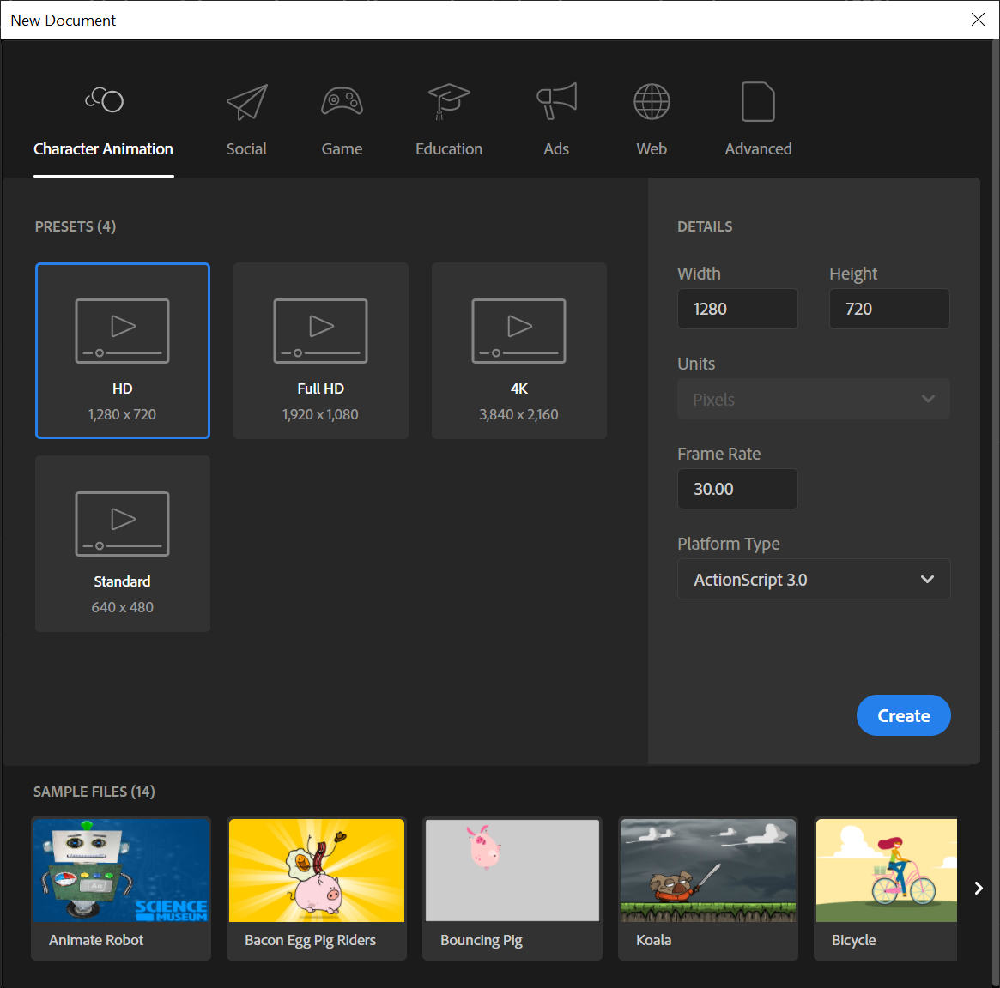
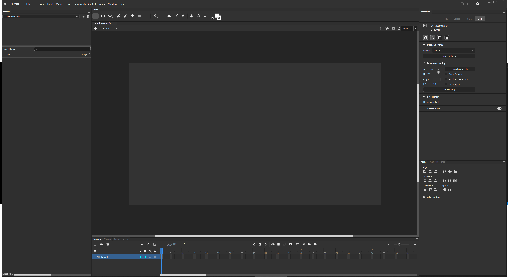
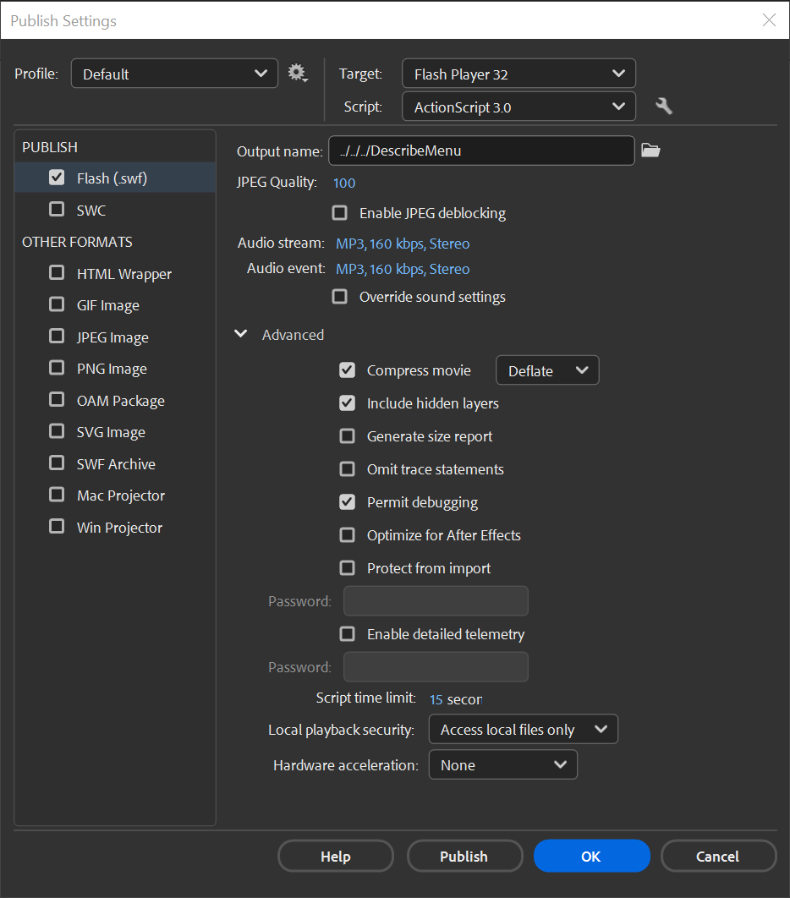
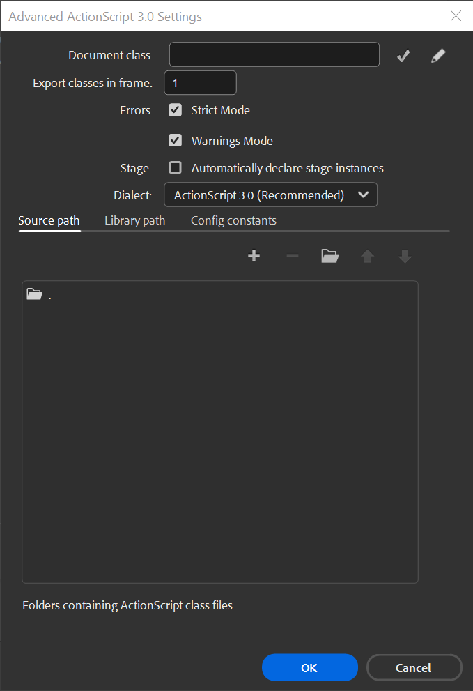

# Custom Menu
This guide details the process of creating a custom menu in Fallout 4.
This guide was written for authors who want to add interactive, dynamic menus to their Fallout 4 mods.

### Prerequisites
- Knowledge of Papyrus scripting.
- Installed Fallout 4 Creation Kit.
- Installed Fallout 4 Script Extender (F4SE)
- Installed Adobe Flash or Adobe Animate
- Ensure your `Fallout 4\Data` folder is organized.

### Introduction
The goal of this project is to create a custom menu which can display information about any provided game data.
It will be capable of describing game references, Papyrus script data, diagnostic information about the UI, and some other odds and ends.
Our project name will be `Describer` with a new menu called `DescribeMenu`.

This custom menu will display the property values for the requested game data.
The menu will be opened and closed by key press using F4SE provided Papyrus events.
A Papyrus script will send game data to the custom menu using F4SE `UI` functions.
Then ActionScript will update the custom menu's UI elements with the received data.

We will start by designing the user interface in Adobe Flash.
Then we will implement an ActionScript class for our menu.
After that we will write Papyrus scripts to integrate will our custom menu.
By using F4SE Papyrus script extensions we can facilitate two-way data communication to the user interface.

### Create a project directory
The playable user interface files are in the `Fallout 4\Data\Interface\` folder.
The user interface source files are in the `Fallout 4\Data\Interface\Source\` folder.

This is like the way Papyrus script directories are structured.
All first level folders of the `Fallout 4\Data\Interface\Source\` are to be considered source directory imports for your Flash documents.

Let's start by creating a source import called `Describer` which is our project name.
Create the new folder here `Fallout 4\Data\Interface\Source\Describer`.

### Creating a new Flash document
Now start the Flash IDE and create a new document.
The document should use a size of `1280x720`, at `30` frames per second, on the `ActionScript 3.0` platform.

Though considered a low resolution by today's standards, design your full screen menus in Flash with dimensions of `1280x720` to match the vanilla menus.
The game will automatically upscale the interface to the user's current resolution without quality loss.

The same goes for the frame rate.
Resist the urge to apply higher values to the Flash document.

Now save the document to `Fallout 4\Data\Interface\Source\Describer\DescribeMenu\DescribeMenu.fla`.

### Setup for the Flash IDE
Consider adjusting your settings or window layout as needed.
Particularly the IDE stage background color for ease of editing, the color `#333333` is often used.
The IDE stage background color won’t affect in-game appearance.

### Setup for publish settings
Select only "Flash (.swf)" as the output format and untick "HTML Wrapper".
Under advanced choose "Permit debugging" and leave everything else as-is.

Set the output name path to `../../../DescribeMenu`. Do not use full paths.
This relative path points to  `Fallout 4\Data\Interface\`, which will work on any machine.

### ActionScript Settings
Now open the "Advanced ActionScript 3.0 Settings" window by selecting the wrench icon next to the "Script" drop down.
Make sure that "Strict Mode" and "Warnings Mode" are both enabled, then disable "Automatically declare stage instances".

The "Source path" tab displays a list of directories that your Flash document will look for script files in.
The `.` notation represents a relative path to the directory containing the Flash document.
In other words, a `.` means your FLA will search for `*.as` files in its own directory.

Another path notation is `..\` which points the path to the parent directory as we just saw with the publish output path for our `DescribeMenu.swf` file.
These can be stacked like `..\..\..\`, which in turn would point to a folder 3 levels higher than the current directory.

For this example, we will leave the "Document class" blank.

### Option 1: Add class linkage to a Flash document
Now lets create the main class for our new Flash document.

See [Adding class linkage to the Flash document]() to learn how to add class linkage to a Flash document.

### Designing the menu elements
We now have our menu which is a `MovieClip` symbol with the `DescribeMenu.as` class attached.
This will act as a visual container for our text, graphics, and animations.
The attached `DescribeMenu.as` class will manage the visual elements, for example showing or hiding elements, or filling a `TextField` with text data.
Our `DescribeMenu.as` class is able to target specific stage elements when you assign those elements an "instance name".

Lets dive into designing our menu now.

---
The document is a work in progress beyond this point.
---

### Create Library Objects
Use Adobe Flash to organize your library objects.
Create symbols, text boxes, and other UI elements as needed.
Organize your library objects in Flash.
This includes creating symbols and text boxes for your menu.

See also [Add class linkage to MovieClip]() to learn how to add class linkage to a `MovieClip` library object.

### Embed Fonts
Embed the required fonts into your SWF file to ensure text displays correctly in-game.
To ensure text displays correctly in-game, embed the fonts into your SWF file.

### Define Initial Menu Elements
Start by creating text fields and shapes as needed for your menu.

### Assign Instance Names
Give instance names to your text boxes and other elements for later reference in scripts.

### Publish Settings
Adjust your publish settings to ensure the SWF file is output to the 'Interface' folder in your Fallout 4 data directory.
Set the output of your Flash project to point to the `Interface` folder in your Fallout 4 data directory.

## Integrating with Papyrus

### Papyrus Scripts

0. **PPJ Project File**
- Defines the Papyrus project settings, imports, and output directories for compiling the scripts.

1. **Scribe:Type Script**
- Provides a base type for shared functionality and event declarations.
- Includes event handling for game reloads and setup for a menu data structure.

2. **Scribe:Menu Script**
- Extends `Scribe:Type`.
- Manages the menu state (open/close), interacts with the Scaleform menu via xSE.
- `SetData` function sends structured data to the ActionScript side.
- Uses properties to manage menu states and flags.

3. **Scribe:Data Script**
- Also extends `Scribe:Type`.
- Responsible for initializing and updating menu data.
- Handles key presses and menu events to toggle and update the custom menu.

### Create a New Import Folder
This is for your Papyrus scripts.

### Setup Papyrus Project
Define the imports and paths for your Papyrus scripts.
Create a new import folder for your Papyrus scripts and set up your Papyrus project with the required imports and paths.

### Write Papyrus Scripts
- Create scripts to handle the menu logic, including open/close functions and data handling.
- Implement functions for registering the menu and handling game reloads.

Develop scripts to handle menu logic, including open/close functions and data handling.

Key scripts include `Scribe:Type`, `Scribe:Menu`, and `Scribe:Data`.
- `Scribe:Type Script`: Acts as a base type for shared functionality and event declarations. This script manages events related to game reloads.
- `Scribe:Menu Script`: Extends Scribe:Type. It manages the custom menu's state (open/close) and communicates with the ActionScript side via xSE. It includes methods for toggling the menu state and setting data.
- `Scribe:Data Script`: Also extends Scribe:Type. It initializes and updates menu data, handles key presses, and manages menu events for opening and closing the custom menu.

### Compile Scripts
Use the Papyrus compiler to compile your scripts.

### Attach Scripts to Quest
In Creation Kit, attach your compiled scripts to a new or existing quest.

## Testing and Debugging

### Load and Test in Game
Load your plugin in Fallout 4 and test the functionality of your custom menu.
Use the console and logs for debugging.

### Debug and Iterate
Use logs and in-game testing to debug and refine your menu.
Adjustments can be made in both the ActionScript and Papyrus scripts.

### Tips

#### Hot Reloading
Adobe Flash allows for hot reloading, enabling you to make changes and recompile without closing the game.

#### Logging
- Enable and implement logging in your Papyrus code for effective debugging.
- Enable and implement logging in your ActionScript code for effective debugging.
